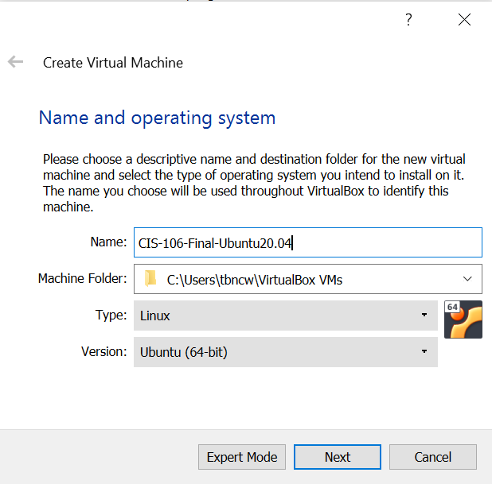

# Project Description
 Your goal is to prepare and document a computer setup for every day using Ubuntu (or an Ubuntu Flavor) as the main operating system. 

# Requirements
* 
# Detailed Step by step instructions on how to:
## * Install Ubuntu 20.04
###  1. In VirtualBox, click New. Type in a name, leave the machine folder, change the type to Linux, and the version to Ubuntu(64-bit) Click next.

###  2. In Memory size, choose 2048 MB (2GB)
.png)
###  3. In Hard Disk, choose create a virtual hard disk now
.png) 
###  4. In Hard disk file type, choose VDI.
.png)
###  5. In Storage on physical hard disk, choose dynamically allocated
.png)
###  6. a
.png)
###  7. a
.png)
###  8. a
.png)
###  9.  a
###  10. a
###  11. a
  12. a
  13. a
  14. a
  15. a
  16. a
  17. a
  18. a
  19. a
  20. a
  21. a
  22. a
  23. a
    *  
    * 

    * 
* Update Ubuntu and best practices
* Install software via the command line and graphically using the software center
* Basic commands
* How to connect your computer to the internet
* Applications to perform everyday tasks:
    * Internet browsing
    * Reading email
    * Remote assistance/connection
    * Office Suite (Writing documents, creating presentations, using spreadsheets)
    * Entertainment
        * Steaming media
        * Playing games
        * Chat
    * School work
        * Programing
        * Educational Applications
        * Video Calling applications (Example: Zoom)
* Getting help with Ubuntu and troubleshooting tips

# Install the Software

# Difficulties Encountered

# Works Cited