# Project Description
 Your goal is to prepare and document a computer setup for every day using Ubuntu (or an Ubuntu Flavor) as the main operating system. 

# Requirements
* 
## Detailed Step by step instructions on how to:
### A. Install Ubuntu 20.04
####  1. In VirtualBox, click New. Type in a name, leave the machine folder, change the type to Linux, and the version to Ubuntu(64-bit) Click next.

####  2. In Memory size, choose 2048 MB (2GB)
.png)
####  3. In Hard Disk, choose create a virtual hard disk now
.png) 
####  4. In Hard disk file type, choose VDI.
.png)
####  5. In Storage on physical hard disk, choose dynamically allocated
.png)
####  6. In File location and size, keep the default location, change the size to at least 50 GB. Click "Create".
.png)
####  7.  Click settings, under General click the advanced tab, choose bidirectional for both Shared Clipboard and Drag'n'Drop
.png)
####  10. Click the Description tab and enter the computer information.
.png)
####  11. Click System in the left side. In Boot Order, remove the check next to Floppy, keep the checks next to Optical and Hard Disk. In Extended Features, check Enable I/O APIC and Hardware Clock in UTC Time.
.png)
####  12. Still under System, click the Processor tab slide the tab to 2 CPUs, leave the Execution Cap.
.png)
####  13. Click Display on the left side. In Screen, slide the Video Memory to 128 MB, Check Enable 3D Acceleration, leave the other settings as they are.
.png)
####  15. Click Storage on the left side. Under Storage Device click Empty, click the disk, choose a disk file. I already had UBUNTU downloaded, so i chose the ubuntu disk.
.png)
####  16. In Audio, check enable audio. This is so you can listen to and record audio. 
.png)
####  17. We can now open the new VM
.png)
#### 18. Once we start the machine, an Install window will pop up. Here we have the option to try Ubuntu or install it. Click Install Ubuntu
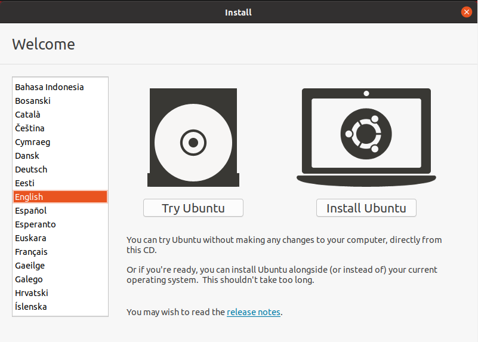
#### 19. Chose the keyboard layout and click continue.
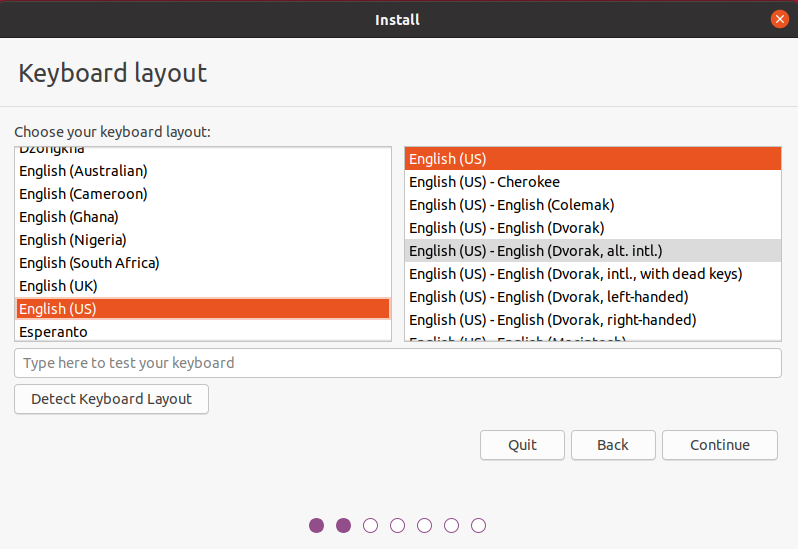
#### 20. I chose Normal installation and Download Updates while installing Ubuntu. Click continue.
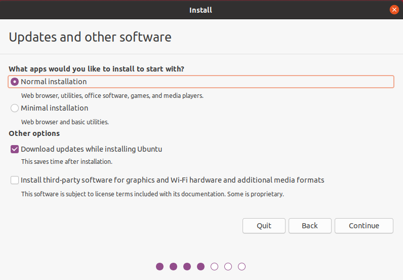
#### 21. I chose to erase the disk and install Ubuntu
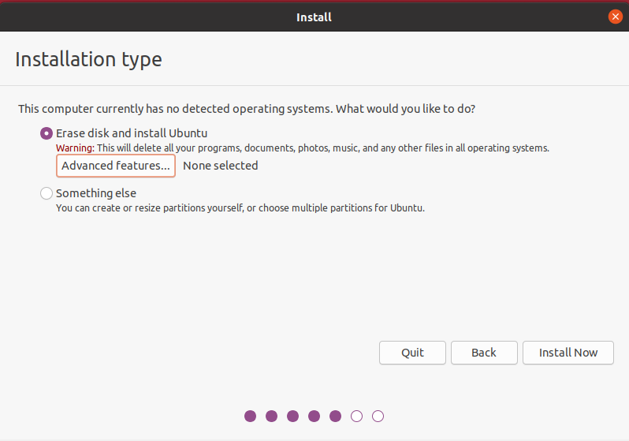
#### 22. A prompt asking if you want to write the changes to disks pops up. Click Continue
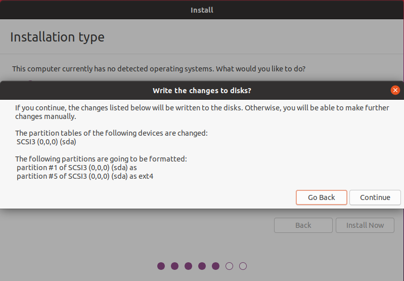
#### 23. Chose time zone in the "Where are you?" box. Click Continue
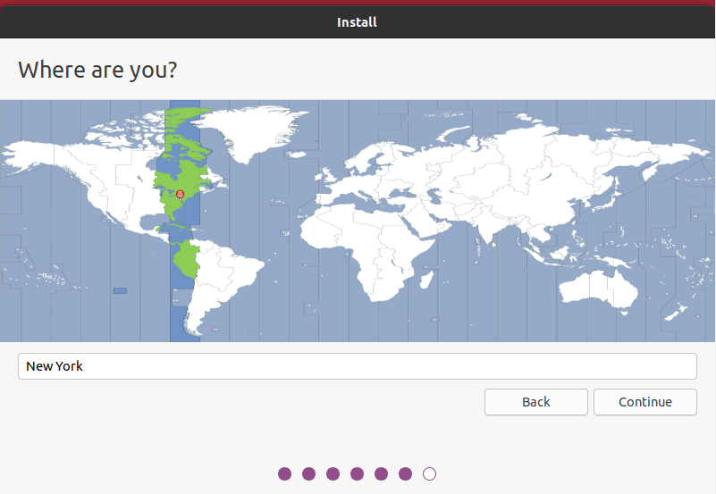
#### 24. Fill out the information in the "Who are you?" box. Click Continue.
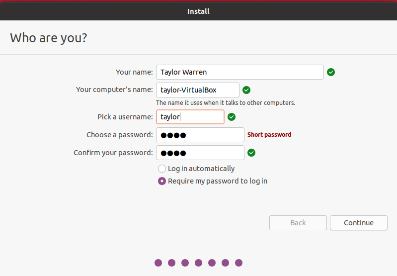
#### 25. Wait for the installation to complete.
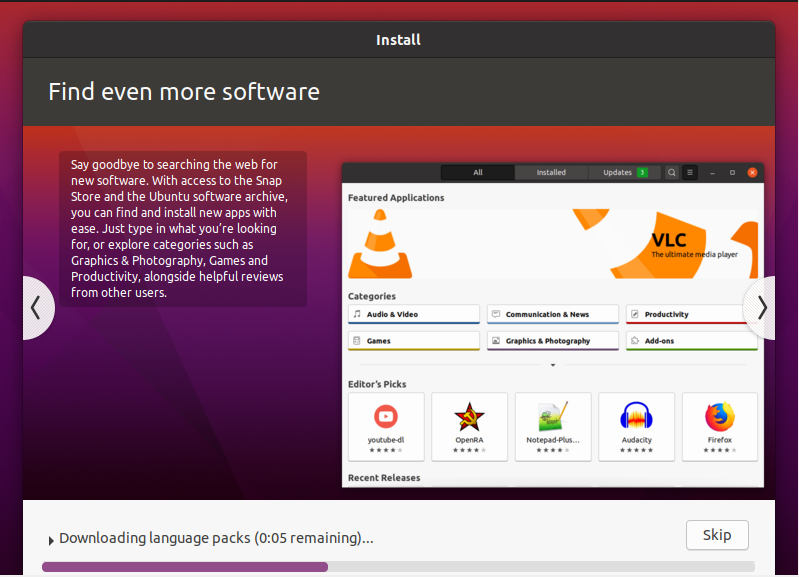
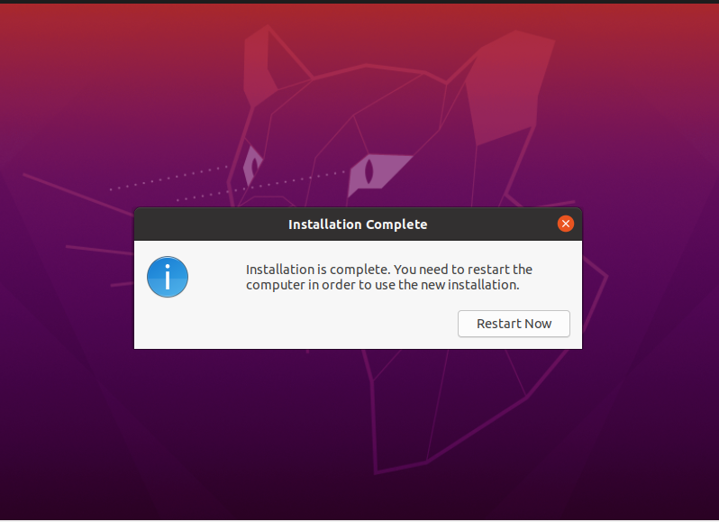
#### 26. Restart the computer after installation.
#### 27. There is no medium to remove, press Enter.
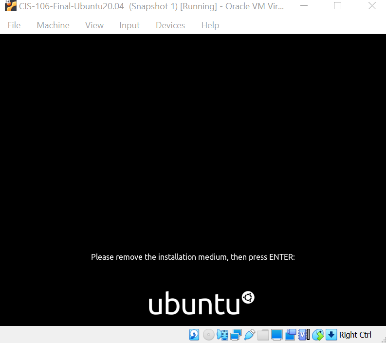
#### 28. Select the user, enter the password
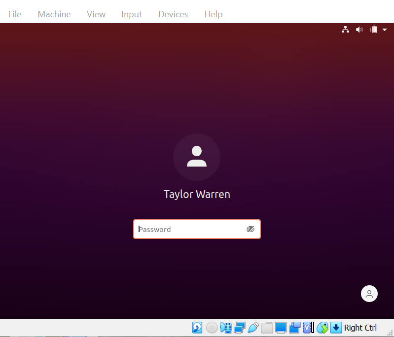

### B. Update Ubuntu and best practices
During installation, we chose to download Ubuntu updates. 
### C. Install software via the command line and graphically using the software center
### D. Basic commands
### E. How to connect your computer to the internet
### F. Applications to perform everyday tasks:
  * Internet browsing
  * Reading email
  * Remote assistance/connection
  * Office Suite (Writing documents, creating presentations, using spreadsheets)
  * Entertainment
      * Steaming media
      * Playing games
      * Chat
  * School work
      * Programing
      * Educational Applications
      * Video Calling applications (Example: Zoom)
* Getting help with Ubuntu and troubleshooting tips

# Install the Software

# Difficulties Encountered

# Works Cited