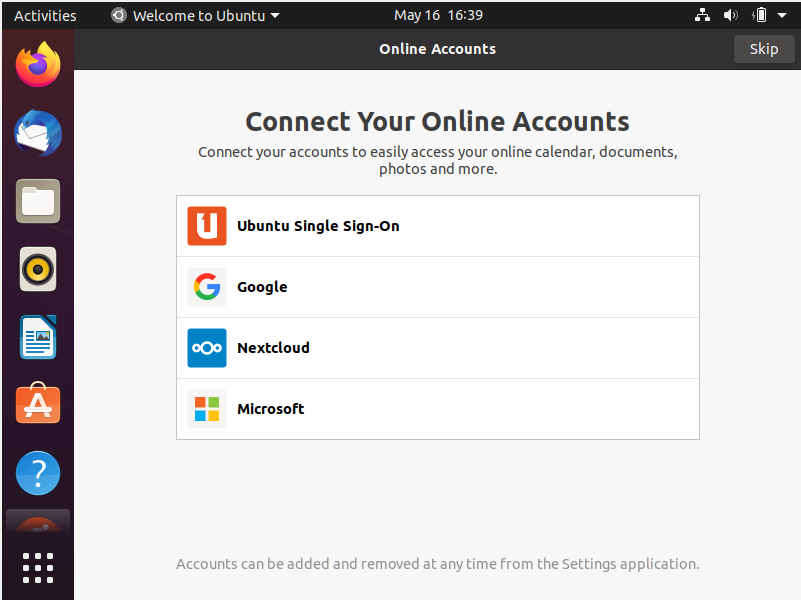
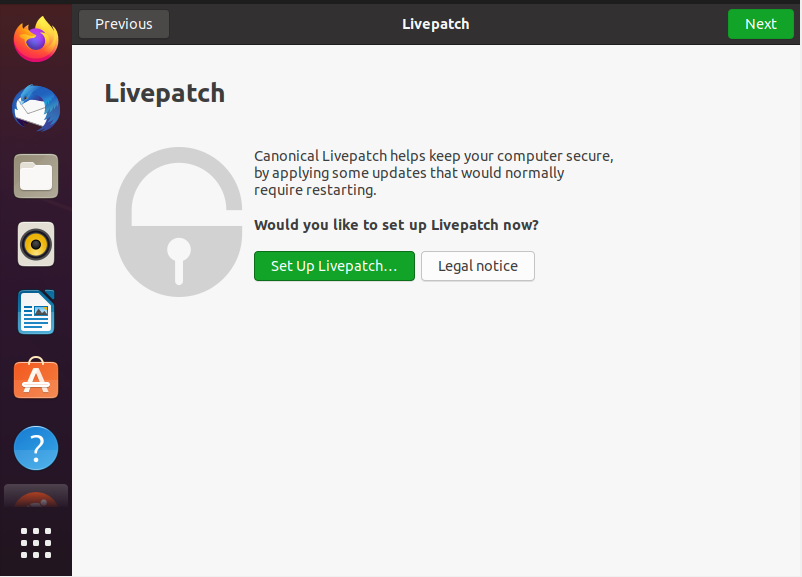

# Set Up a Linux Virtual Computer

<!-- TOC -->autoauto- [Set Up a Linux Virtual Computer](#set-up-a-linux-virtual-computer)auto- [Project Description](#project-description)auto- [Requirements](#requirements)auto    - [Detailed Step by step instructions on how to:](#detailed-step-by-step-instructions-on-how-to)auto        - [A. Install Ubuntu 20.04](#a-install-ubuntu-2004)auto        - [B. Update Ubuntu and best practices](#b-update-ubuntu-and-best-practices)auto            - [To set up Livepatch follow these instructions:](#to-set-up-livepatch-follow-these-instructions)auto        - [C. Install software via the command line and graphically using the software center](#c-install-software-via-the-command-line-and-graphically-using-the-software-center)auto            - [To install software there are a few options:](#to-install-software-there-are-a-few-options)auto        - [D. Basic commands](#d-basic-commands)auto        - [E. How to connect your computer to the internet](#e-how-to-connect-your-computer-to-the-internet)auto        - [F. Applications to perform everyday tasks:](#f-applications-to-perform-everyday-tasks)auto- [Install the Software](#install-the-software)auto- [Difficulties Encountered](#difficulties-encountered)auto- [Works Cited](#works-cited)autoauto<!-- /TOC -->
# Project Description
 In this project, I am creating a virtual machine for everyday use as a student using Ubuntu as the main operating system. 

# Requirements
* This project requires the use of a Linux Virtual Machine on VirtualBox. I used the following specifications:
  * Hard Drive: 50GB
  * RAM: 2028 MB (2GB)
  * CPU: 2 processors
  * Video Memory: 128 MB
  * Audio controller: ICH AC97
  * Network card: 1 NAT
  * Operating System: Ubuntu 64-bit
  
## Detailed Step by step instructions on how to:
### A. Install Ubuntu 20.04
   1. In VirtualBox, click New. Type in a name, leave the machine folder, change the type to Linux, and the version to Ubuntu(64-bit) Click next.

   2. In Memory size, choose 2048 MB (2GB)
.png)
   3. In Hard Disk, choose create a virtual hard disk now
.png) 
   4. In Hard disk file type, choose VDI.
.png)
   5. In Storage on physical hard disk, choose dynamically allocated
.png)
   6. In File location and size, keep the default location, change the size to at least 50 GB. Click "Create".
.png)
   7.  Click settings, under General click the advanced tab, choose bidirectional for both Shared Clipboard and Drag'n'Drop
.png)
   10. Click the Description tab and enter the computer information.
.png)
   11. Click System in the left side. In Boot Order, remove the check next to Floppy, keep the checks next to Optical and Hard Disk. In Extended Features, check Enable I/O APIC and Hardware Clock in UTC Time.
.png)
   12. Still under System, click the Processor tab slide the tab to 2 CPUs, leave the Execution Cap.
.png)
   13. Click Display on the left side. In Screen, slide the Video Memory to 128 MB, Check Enable 3D Acceleration, leave the other settings as they are.
.png)
   15. Click Storage on the left side. Under Storage Device click Empty, click the disk, choose a disk file. I already had UBUNTU downloaded, so i chose the ubuntu disk.
.png)
   16. In Audio, check enable audio. This is so you can listen to and record audio. 
.png)
   17. We can now open the new VM
.png)
  18. Once we start the machine, an Install window will pop up. Here we have the option to try Ubuntu or install it. Click Install Ubuntu

  19. Chose the keyboard layout and click continue.

  20. I chose Normal installation and Download Updates while installing Ubuntu. Click continue.

  21. I chose to erase the disk and install Ubuntu

  22. A prompt asking if you want to write the changes to disks pops up. Click Continue

  23. Chose time zone in the "Where are you?" box. Click Continue

  24. Fill out the information in the "Who are you?" box. Click Continue.

  25. Wait for the installation to complete.

  26. Restart the computer after installation.
  27. There is no medium to remove, press Enter.

  28. Select the user, enter the password

### B. Update Ubuntu and best practices
 During installation, we chose to download Ubuntu updates. Once the computer starts, there is the option to connect online accounts.
 
 Canonical offers Livepatch for security. 
  
#### To set up Livepatch follow these instructions:
1. Click Set Up livepatch...
2. Enter password. Click authenticate. ![livepatch2]
3. To use Livepatch, you need an Ubuntu One Account. Click Sign In/ Register ![livepatch3]
4. Enter your email address. If you already have an account, sign in. If not register for an account. If you forgot the password, select the option and click Connect ![livepatch4]
5. I needed to create an account. I filled in the requested information. Click create account ![livepatch5.1] ![livepatch5.2] ![livepatch5.3]
6. This will bring you to a personal details page where you can go over the information you just entered. Click the red X  to close the website. 
7. You will sign in. Now Livepatch is enabled. 
### C. Install software via the command line and graphically using the software center
#### To install software there are a few options:
1. Graphically
### D. Basic commands
### E. How to connect your computer to the internet
### F. Applications to perform everyday tasks:
  * Internet browsing
  * Reading email
  * Remote assistance/connection
  * Office Suite (Writing documents, creating presentations, using spreadsheets)
  * Entertainment
      * Steaming media
      * Playing games
      * Chat
  * School work
      * Programing
      * Educational Applications
      * Video Calling applications (Example: Zoom)
* Getting help with Ubuntu and troubleshooting tips

# Install the Software

# Difficulties Encountered
    I had one major difficulty while completing this project. My host computer lost power, I did not save my work often, and in turn I had to repeat quite a few things to get needed screen shots. I am currently redoing the installation of software using the GUI interface and the command line. 

# Works Cited
* Linux Workshop. "Lab 2 Installing Ubuntu 20.04 in VirtualBox" YouTube, 11 Feb. 2021, https://www.youtube.com/watch?v=8miYpGvxZL8.
* Alberto, Robert. "Installing Ubuntu 20.04 on VirtualBox." Linux Fundamentals. Lecture 2. https://bit.ly/3omFTwO0
* 
 