# Learning the Bash Shell
* Exploring desktop environments
  * Gnome DE 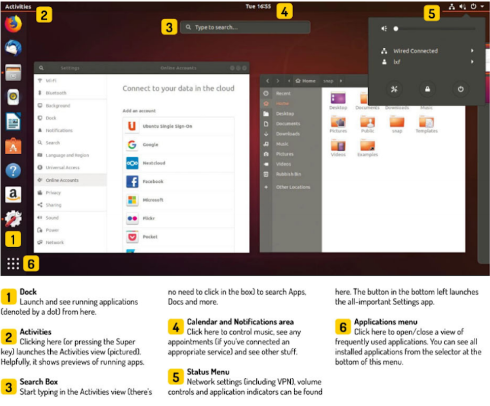
  * GNOME 3: Default desktop in Ubuntu and several Linux distros (Debian, Fedora, Red Hat, Enterprise Linux, Oracle Linux)
    * official GUI called **GNOME Shell**
  * KDE DE 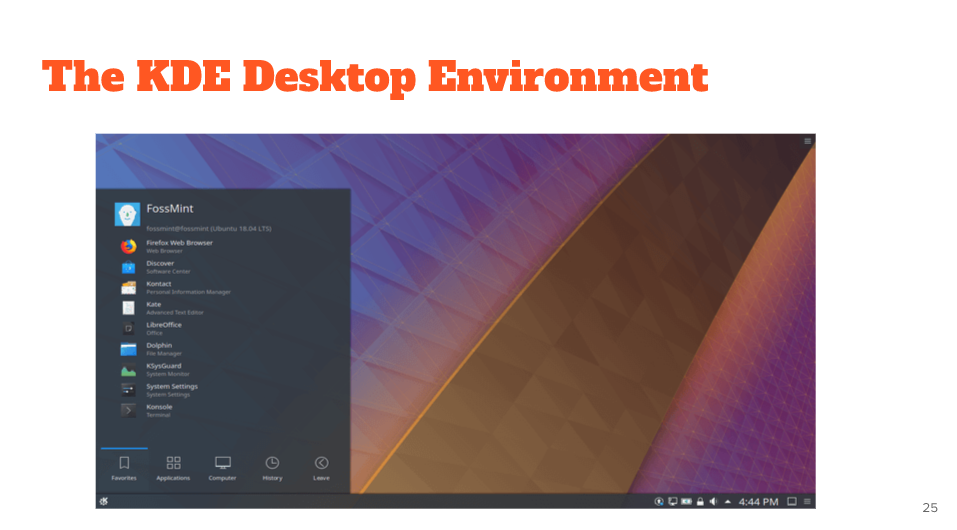
    * now **KDE Plasma**
  * XFCE DE 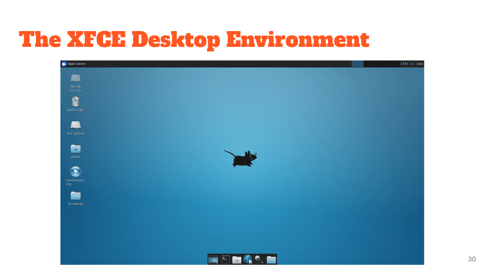
  * official flavor with this is called **Xbuntu**
  * Mate DE 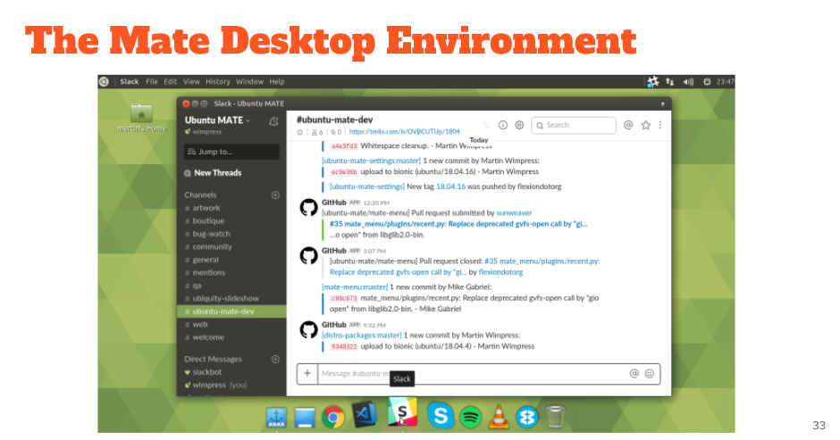
    * continuation of GNOME 2.
    * forked apps oft named in spanish 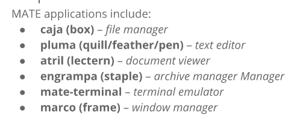
  * Cinnamon DE 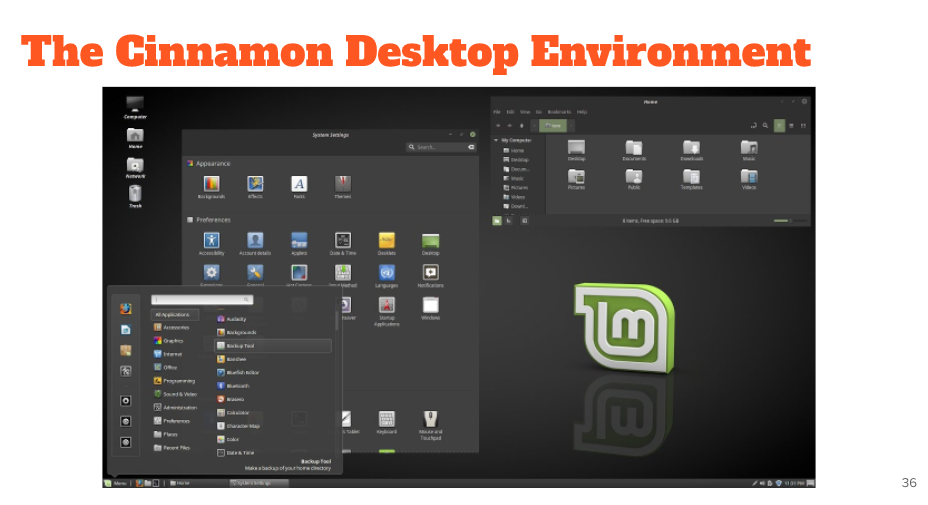
    * principle de of Linux Mint
    * easy with gentle learning curve
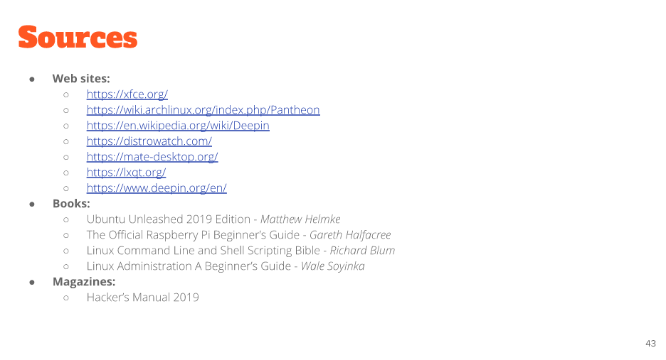
* What is a shell? The shell is an interactive interface that allows users to execute other commands and utilities in Linux and other UNIX-based operating systems. When you login to the operating system, the standard shell is displayed and allows you to perform common operations such as copy files or restart the system.
  * Linux Terminal
    * CLI: command line interface.
      * means to interact with a computer program where the user issues commands in the form of successive lines of text.
      * accessed through terminal emulator (Gnome Terminal, Konsole, Terminology, RXVT-Unicode, TILIX)  and linux console (text mode).
    * Bash Shell: program that provides interactive access to the Linux system. 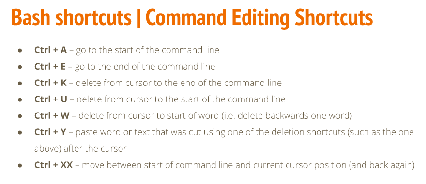 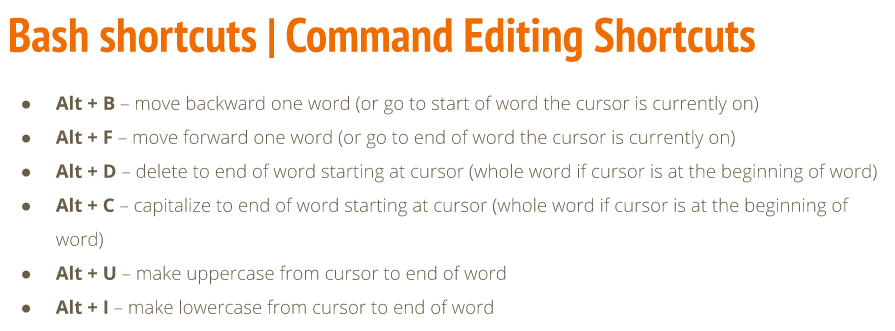 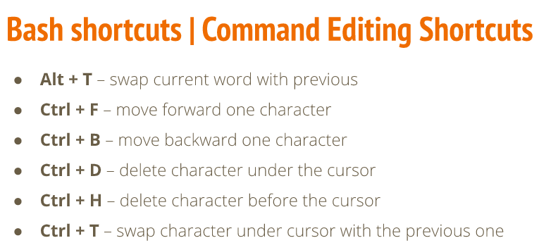 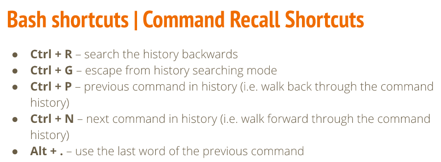 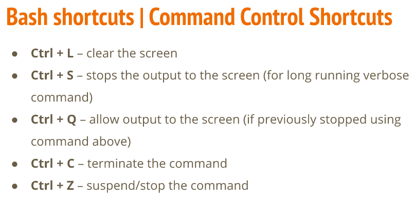 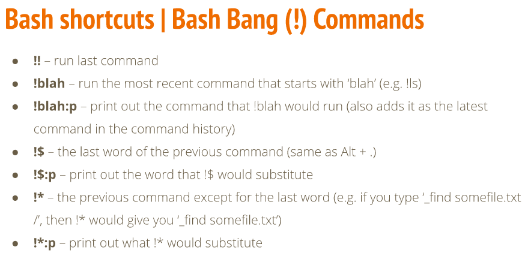
      * To copy: CTRL + Shift + C
      * To paste: CTRL + Shift + V
* Managing software
  * Basic Terminology
    * Package: archive that contains binaries of software, config files, and info about dependencies
      * box containing all the necessary stuff to install the program you want.
    * Library: reusable code that can be used by more than one function or program.
    * Dependency: software needed as foundation for other software.
    * Repository: collection of software available for download
  * DPMS: Debian Package Management System
    * package names end with **.deb** extension. Called .deb files.
  * APT: Advanced Package Tool
    * handles dependencies in software
    * installation resuming: if you lose internet while installing, APT picks up where it stopped.
    * used for updating 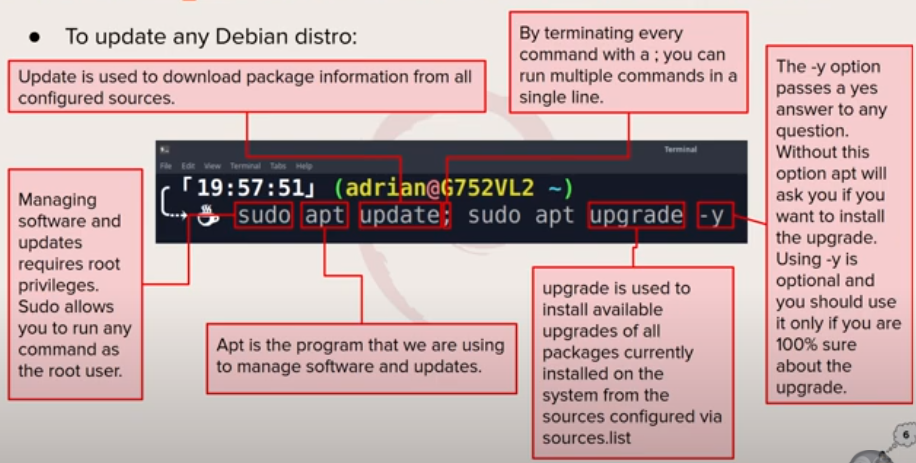
* the Linux filesystem
