# Manipulating files and directories
* managing files and directories
  * Creating and deleting files and directories
    * mkdir: used to create a single directory or multiple directories 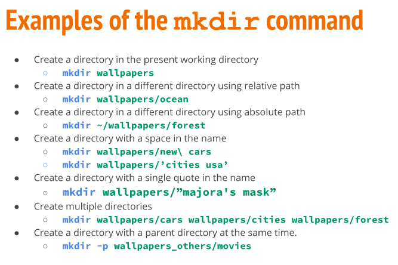
    * touch: used to create files 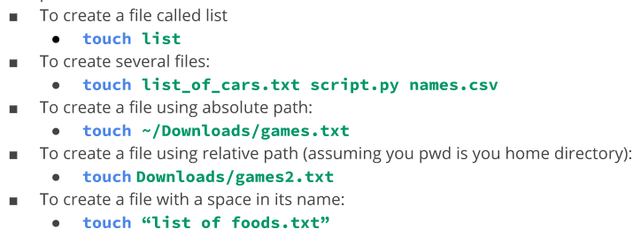
    * rm: removes files and directories 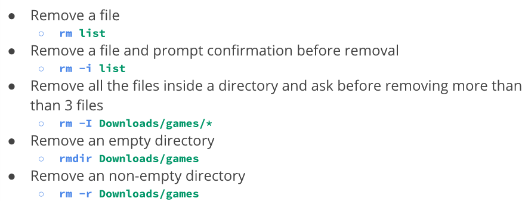
  * Moving and copying files and directories
    * mv: moves and renames files and directories 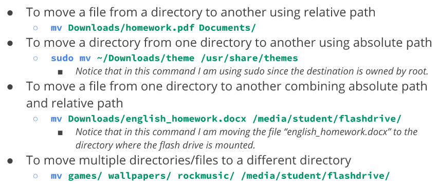 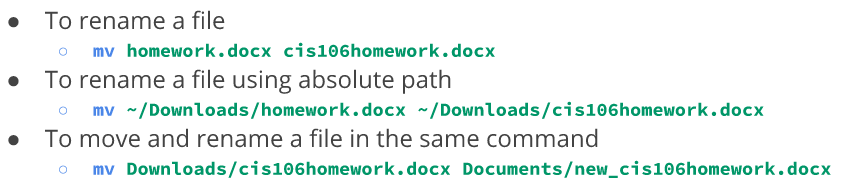
    * cp: copies a file or directory from source to destination 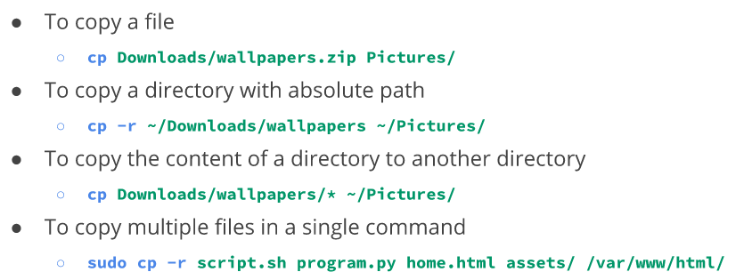
    * inode: data structure that contains all information about a file EXCEPT file name and contents. 
      * every file has an inode/index number
      * to view: *ls -i* command
    * hard link: file that points to data on the hard drive.
      * when files are created, they automatically link to data stored in the dard drive and assigned an inode number.
      * creating a hard link does NOT create a copy!
      * to create: *ln file ~/Downloads/fileHL*
    * soft link: (symbolic link) special type of file that points to other files instead of data in the hard drive (different inode number than hard link)
      * can point to files stored on different partitions
      * to create: *ln -s file fileSL* 
  * getting help
    * man: (manual)quick reference to commands, executable programs, system calls, special files... etc.
      * to view the manual of a command: man + command (man mv)
      * navigate using arrow keys or internal shortcuts
      * press "q" to exit. 
    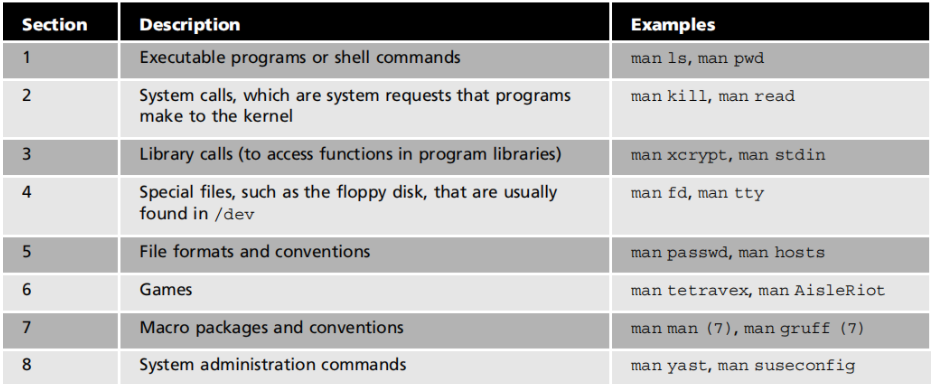
    * Other ways to get help. 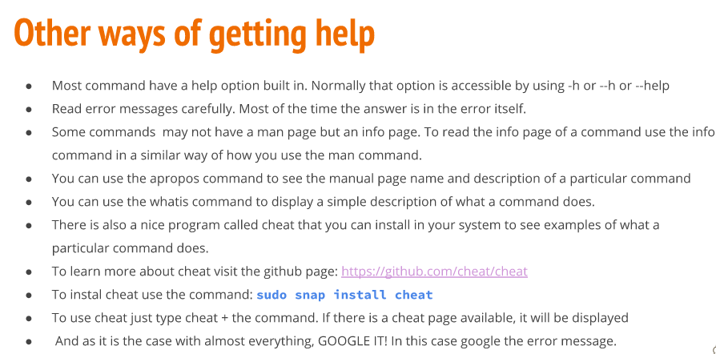
  

  * working with wildcards
    * The * wildcard
      * matches any number of characters
      * 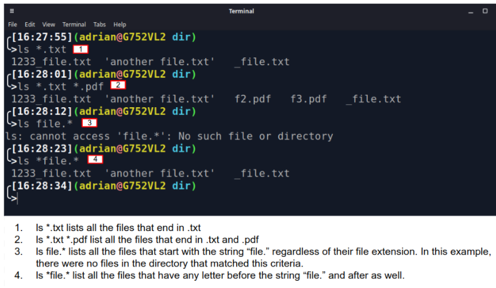
    * The ? wildcard
      * matches ONE character.
      * 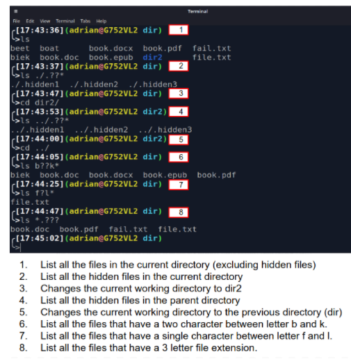
    * The [] wildcard
      * match a single character in a range
      * 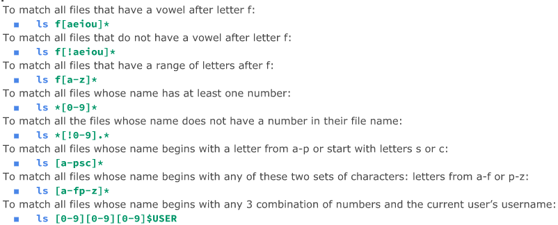
      * can use POSIX or character classes
      * 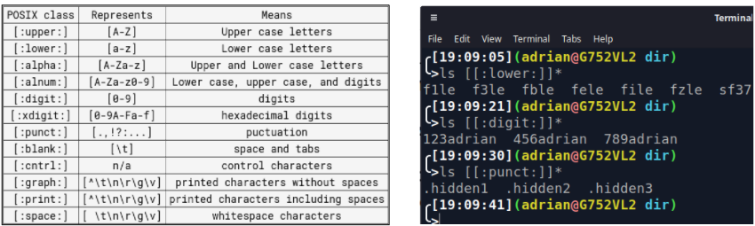
  * shell expansion
    * Brace Expansion: allows generation of arbitrary strings to use with commands
    * 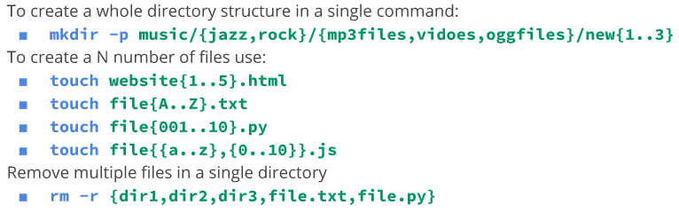