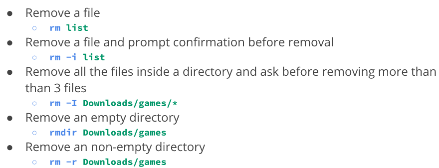
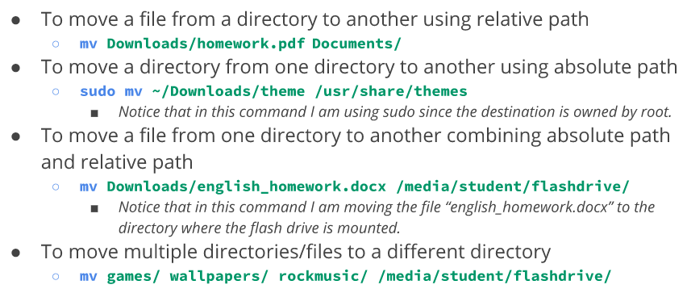
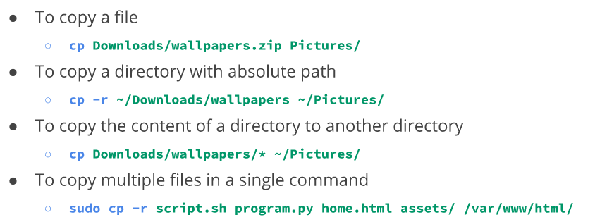
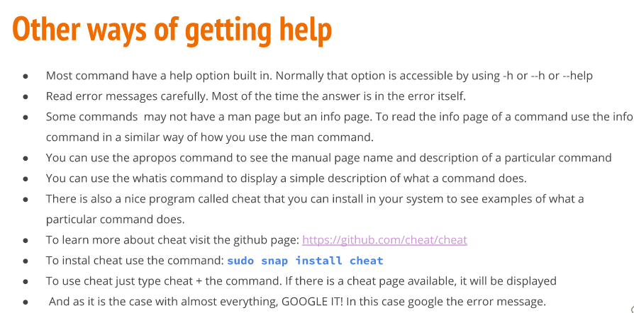
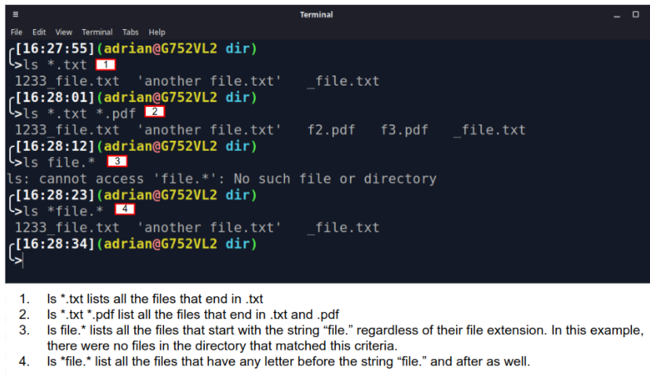
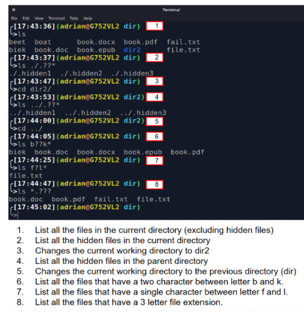
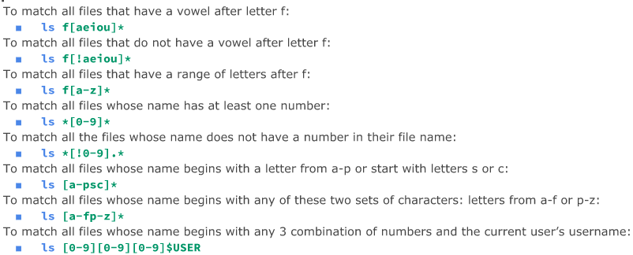

 **Taylor Warren Final Notes**
<!-- TOC -->autoauto- [1. Why do you need to learn Linux?](#1-why-do-you-need-to-learn-linux)auto- [2. What is Linux?](#2-what-is-linux)auto- [3. Linux Books I can use:](#3-linux-books-i-can-use)auto- [4. Linux Distributions](#4-linux-distributions)auto- [5. Linux Architecture](#5-linux-architecture)auto- [6. Software Licensing Agreement](#6-software-licensing-agreement)auto- [7. Advantages/Disadvantages of Open Source Software](#7-advantagesdisadvantages-of-open-source-software)auto- [8. What is Ubuntu?](#8-what-is-ubuntu)auto- [9. Installing Ubuntu](#9-installing-ubuntu)auto- [10. Manipulating files and directories](#10-manipulating-files-and-directories)autoauto<!-- /TOC -->

# 1. Why do you need to learn Linux?
* Linux runs on many different devices. 
  * Example: Laptops, desktops, servers, smartphones, IoT devices, etc.
* Linux powers the cloud.
* Linux is used by a wide variety of companies including Microsoft.
# 2. What is Linux?
* Linux is a kernel
  * Kernel = the core of an operating system
* An operating system that uses the Linux kernel is called a Linux Distribution.
  * Example: Ubuntu, Android
* Linux is a multitasking, multi-user, and multipurpose OS.
* Linux is a modular operating system.
  * all its components are separate from each other.
# 3. Linux Books I can use:
* Linux Administration A Beginner's Guide 8th Edition by Wale Soyinka
  
* CompTia Linux+ Study Guide by Christine Bresnahan
  
* The Linux Command Line by William Shotts
  
# 4. Linux Distributions

* There are a large number of Linux Distributions.
* **The Two Main Linux Distributions** are:
  * Debian
  * Redhat
* There are also other **independent** distributions:
  * Slackware
  * Arch
  * Gentoo
# 5. Linux Architecture

* Linux is modular which means that users can add anything needed and/or remove anything unwanted or unneeded.
  * **Kernel** = The core of the operating system. Manages the hardware.
  * **Daemons** = background programs that run independent of the user.
  * **Shells** = the interface that accepts user input and translates it so that the kernel can use it.
  * **Graphical Desktop Environment** = a collection of software that makes the graphical interface.
* In Linux, **EVERYTHING** is a file.
* Types of files:
  * Device
  * Directory
  * Binary
  * Regular
# 6. Software Licensing Agreement
* Alicense agreement outlines the rights a user has to a given software.
* Types of licensing agreements: 
  
Opensource | Closed Source | Free Software 
---------- | ------------- | ------------- 
Software can be distributed for free or a fee. **The source code must be distributed with the software** | Software can be distributed for free or a fee. **The end user has limited access to the software and the source code is NOT available** | Software can be distributed for free or a fee. **The user has total control of the software and the source code** *The software must comply with the 4 freedoms*

Open Source Software | Closed Source Software
-------------------- | ---------------------- 
 Libre office  Mozilla Firefox  VLC Media Player |  Microsoft Office  Internet Explorer  Windows Media Player

**The 4 freedoms**
* Freedom 0: the user can run the program as they wish, for any purpose.
* Freedom 1: the user can study how the program works, and change it.
* Freedom 2: the user can redistribute copies.
* Freedom 3: the user can distribute copies of your modified versions.
# 7. Advantages/Disadvantages of Open Source Software
 
# 8. What is Ubuntu?
* Ubuntu is a **Linux distribution**, freely available with both community and professional support.
* Ubuntu community built on ideas enshrined in Ubuntu Manifesto:
  * Software should be available free of charge
  * software tools should be usable by people in their local language and despite any disabilities
  * people should have the freedom to customize/alter their software in any way

# 9. Installing Ubuntu
* What is Virtualization?
  * Virtualization: replication of hardware to simulate a virtual machine inside a physical machine.
  * 2 general types:
    * Server-side virtualization
      - VDI = Virtual Desktop Infrastructure
        - Thick/fat client: full-featured computers that are connected to a network. Functional whether connected to a network or not.
        - Thin client: computer that runs from resources stored on a central server instead of a localized hard drive. Work by connecting remotely to a server-based computing environment where most apps, sensitive data, and memory are stored.
        - Zero client: has no operating system (OS) and no local storage as an endpoint device.  All desktop applications are provisioned and centrally managed from a remote server.
    * Client-side virtualization
        - Software installed on a computer to manage virtual machines
        - Computer needs:
            1. Hypervisor
            2. Hardware that supports virtualization
               - Capable CPU
               - Enough RAM
               - Enough Storage
  * The main difference is the **location** of virtualization.
* Installing Ubuntu In a virtual machine
  1. After VirtualBox is installed, create a virtual machine with these specs:
     * OS: Ubuntu 20.04 64 Bits
     * HDD: 50 GB
     * RAM: 2 GB (2048 MB)
     * Audio Controller: Disabled
     * CPU: 2 Cores
     * Description:
       * **Hostname:** cis106vm
       *  **User:** TaylorB
       *  **Password:** pccc
     * Shared Clipboard: Enabled - Bidirectional
     * Drag n' Drop: Enabled - Bidirectional     
       * I can cut, paste, drag items from host machine to vm and vice versa  

# 10. Manipulating files and directories
* managing files and directories
  * Creating and deleting files and directories
    * mkdir: used to create a single directory or multiple directories 
    * touch: used to create files 
    * rm: removes files and directories 
  * Moving and copying files and directories
    * mv: moves and renames files and directories  
    * cp: copies a file or directory from source to destination 
    * inode: data structure that contains all information about a file EXCEPT file name and contents. 
      * every file has an inode/index number
      * to view: **ls -i** command
    * hard link: file that points to data on the hard drive.
      * when files are created, they automatically link to data stored in the dard drive and assigned an inode number.
      * creating a hard link does NOT create a copy!
      * to create: **ln file ~/Downloads/fileHL**
    * soft link: (symbolic link) special type of file that points to other files instead of data in the hard drive (different inode number than hard link)
      * can point to files stored on different partitions
      * to create: **ln -s file fileSL** 
  * getting help
    * man: (manual)quick reference to commands, executable programs, system calls, special files... etc.
      * to view the manual of a command: man + command (man mv)
      * navigate using arrow keys or internal shortcuts
      * press "q" to exit. 
    
    * Other ways to get help. 
  

  * working with wildcards
    * The * wildcard
      * matches any number of characters
       
    * The ? wildcard
      * matches ONE character.
       
    * The [] wildcard
      * match a single character in a range
       
      * can use POSIX or character classes
       
  * shell expansion
    * Brace Expansion: allows generation of arbitrary strings to use with commands
     