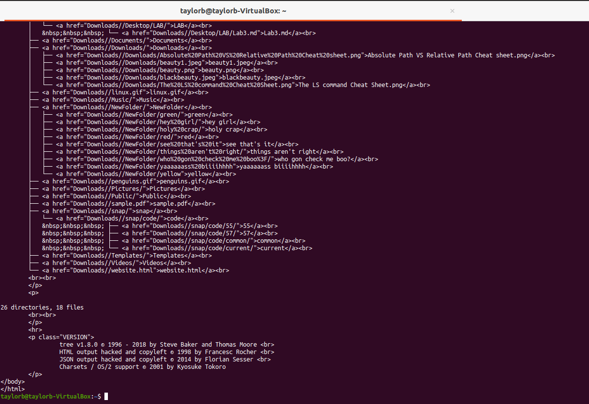

# Lab 3 | Installing software and navigating the file system | Answers
Assignment description [here](https://raw.githubusercontent.com/ra559/cis106/main/labs/lab3.md)

## Question 1
1. Which command did you use to search for the themes and to install them?
   **To search, I used the command "apt search theme". To install the theme I used the command "sudo apt install yuyo-gtk-theme"**
2. Which commands did you use to find and install the web browser?
   **To find the web browser, i used the command "apt search web browser". To install, I used the command "sudo apt install alice"**
3.1 What is the name of the package? 
    **Alice**
3.2 What dependencies are needed in order to install the package? 
(you can either take a screenshot of the terminal or copy and paste from the terminal)
>>libalgorithm-c3-perl libany-moose-perl libanyevent-dbi-perl libanyevent-fork-perl
  libanyevent-http-perl libanyevent-irc-perl libanyevent-perl libapache-logformat-compiler-perl
  libasync-interrupt-perl libb-hooks-endofscope-perl libb-hooks-op-check-perl libcbor-xs-perl
  libcgi-compile-perl libcgi-emulate-psgi-perl libcgi-fast-perl libcgi-pm-perl libclass-c3-perl
  libclass-c3-xs-perl libclass-data-inheritable-perl libclass-inspector-perl
  libclass-method-modifiers-perl libclass-xsaccessor-perl libclone-choose-perl libclone-perl
  libcommon-sense-perl libconvert-scalar-perl libcookie-baker-perl libcookie-baker-xs-perl
  libdata-optlist-perl libdbd-sqlite3-perl libdbi-perl libdevel-callchecker-perl libdevel-caller-perl
  libdevel-globaldestruction-perl libdevel-lexalias-perl libdevel-stacktrace-ashtml-perl
  libdevel-stacktrace-perl libdigest-hmac-perl libdist-checkconflicts-perl libdynaloader-functions-perl
  libemail-date-format-perl libev-perl libeval-closure-perl libexception-class-perl
  libexporter-tiny-perl libfcgi-perl libfcgi-procmanager-perl libfile-pushd-perl libfile-sharedir-perl
  libfilesys-notify-simple-perl libguard-perl libhash-merge-perl libhash-multivalue-perl
  libhttp-entity-parser-perl libhttp-headers-fast-perl libhttp-multipartparser-perl
  libhttp-parser-xs-perl libimport-into-perl libio-fdpass-perl libipc-shareable-perl
  libirc-formatting-html-perl libjson-maybexs-perl libjson-perl libjson-xs-perl liblist-moreutils-perl
  liblog-dispatch-perl liblog-log4perl-perl libmail-sendmail-perl libmime-lite-perl libmime-types-perl
  libmodule-implementation-perl libmodule-refresh-perl libmodule-runtime-perl libmoo-perl libmouse-perl
  libmro-compat-perl libnamespace-autoclean-perl libnamespace-clean-perl libobject-event-perl
  libpackage-stash-perl libpackage-stash-xs-perl libpadwalker-perl libparams-classify-perl
  libparams-util-perl libparams-validationcompiler-perl libplack-middleware-session-perl libplack-perl
  libposix-strftime-compiler-perl libproc-fastspawn-perl libreadonly-perl libref-util-perl
  libref-util-xs-perl librole-tiny-perl libserver-starter-perl libspecio-perl libsql-abstract-perl
  libstream-buffered-perl libstrictures-perl libsub-exporter-perl libsub-exporter-progressive-perl
  libsub-identify-perl libsub-install-perl libsub-name-perl libsub-quote-perl libsys-hostname-long-perl
  libtest-sharedfork-perl libtest-tcp-perl libtext-microtemplate-perl libtypes-serialiser-perl
  libvariable-magic-perl libwww-form-urlencoded-perl libwww-form-urlencoded-xs-perl libxstring-perl
  twiggy

3.3 How much disk space will the package utilize after installation?
**Need to get 4,852 kB of archives.** 
**After this operation, 14.4 MB of additional disk space**
 

## Question 2

## Question 3

## Question 4

## Question 5
The screen shot is of the command that gives all directories instead of all files only because the terminal would not let me scroll to the top where i did the input of the command to screen shot. The command to list all the files in the tree format is:
**tree -aug**
-a lists all files
-u displays file owners
-g displays file group

The command to list all files in the tree format including file size and in human readable format is:
**tree -ash**
-a lists all files
-s prints the size of each file
-h prints the size in a more human readable way

## I was unable to capture the screen shot including the command required commands, so I improvised. I hope this is acceptable with my explanation in question 5.