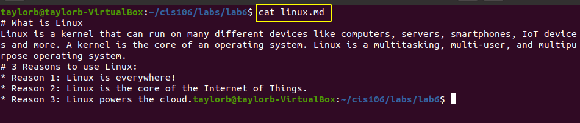
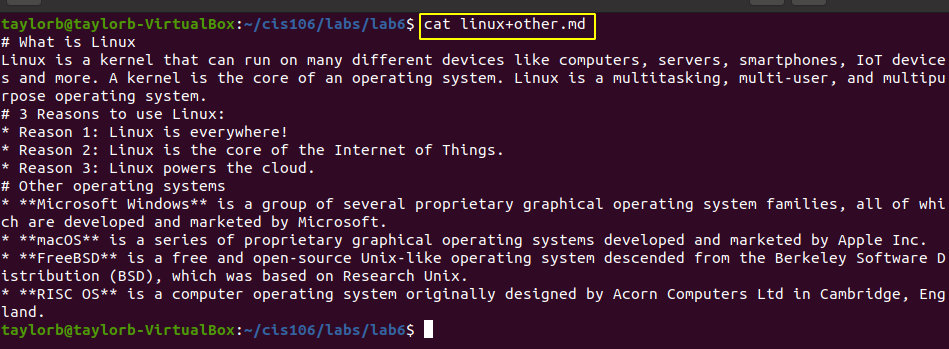
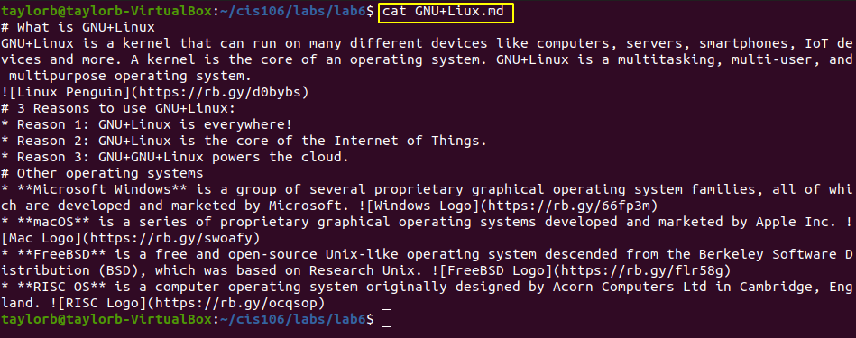

# Lab 6 | Using VIM
linux.md terminal screen shot

linux+other terminal screen shot

GNU+Linux.md terminal screen shot

## Github links

### linux.md 
https://github.com/TaylorB-W/cis106/blob/master/labs/lab6/linux.md

### linux+other.md
https://github.com/TaylorB-W/cis106/blob/master/labs/lab6/linux%2Bother.md

### GNU+Linux.md
https://github.com/TaylorB-W/cis106/blob/master/labs/lab6/GNU%2BLiux.md

