# Lab 7 | Managing Data
## Question 1 | Tar Utility
### Problems 1 and 2
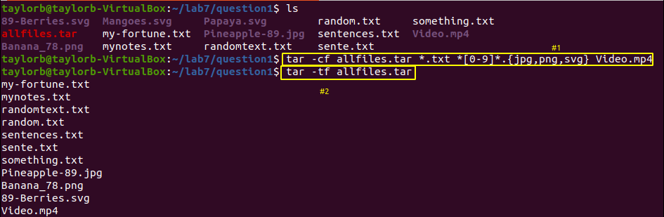
### Problem 3
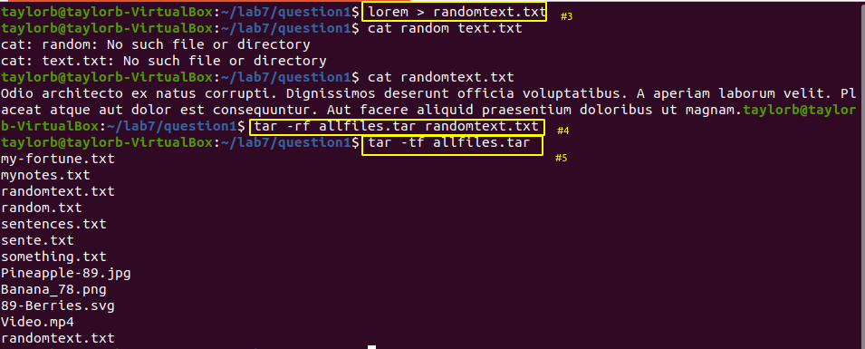

## Question 2 | Cipio Utility
### Problem 1
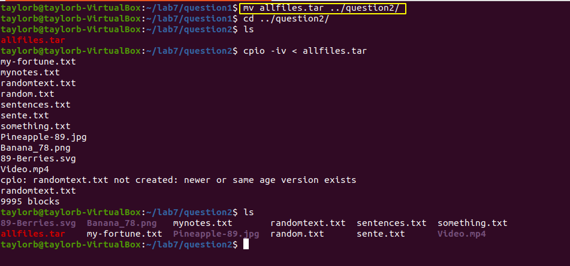
### Problem 2
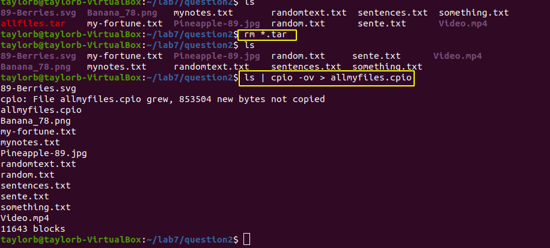
### Problem 3
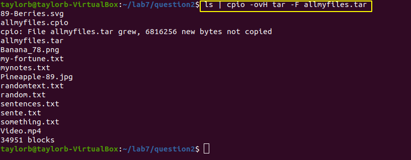
### Problem 4
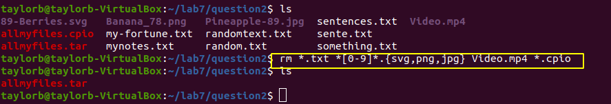
### Problem 5
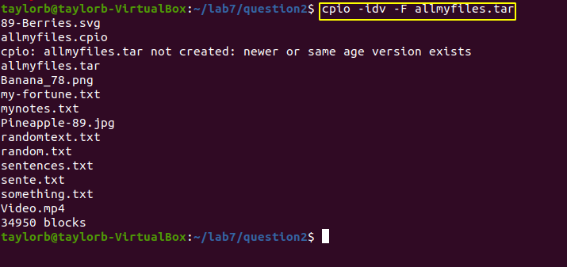

## Question 3 | Gzip, bzip, xz
### Problem 1-5
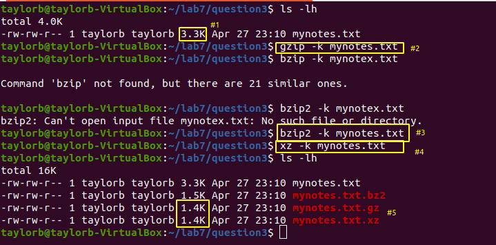
Gzip and xz gave the best compression

## Question 4 | Zip, 7zip, Rar
### Problem 1
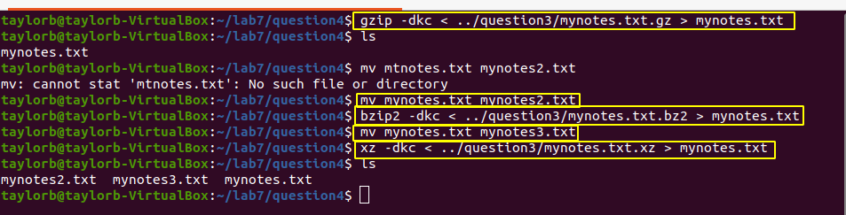
### Problem 2

### Problem 3
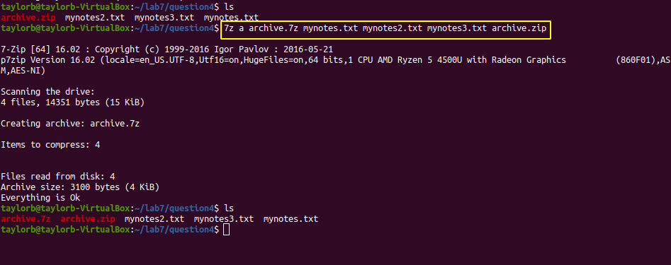
### Problem 4
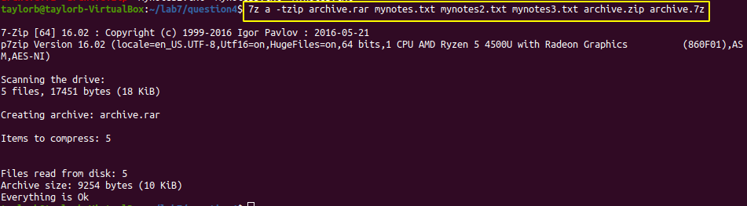
